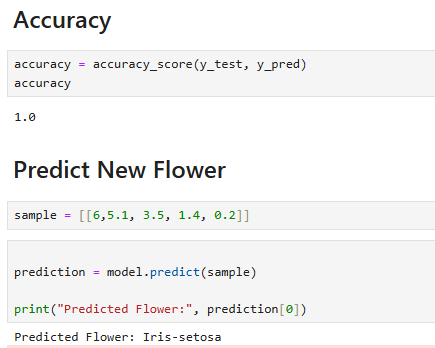

# Iris Classification Project

## Task Information
- **Task Number:** Task 1
- **Project Name:** Iris Classification Analysis
- **Author:** Pranav Panara

---

## Project Objective
The objective of this project is to analyze the Iris dataset and build a machine learning model for flower classification using Python.

---

## Dataset Used
- Iris Dataset (`Iris.csv`)

The dataset contains:
- Sepal Length
- Sepal Width
- Petal Length
- Petal Width
- Species

---

## Technologies & Libraries Used
- Python
- Pandas
- NumPy
- Matplotlib
- Seaborn
- Scikit-learn

---

## Project Workflow
1. Importing required libraries
2. Loading dataset
3. Data preprocessing
4. Exploratory Data Analysis (EDA)
5. Data visualization
6. Model training
7. Prediction and accuracy evaluation

---

## Files Included
- `Pranav_Task1.ipynb`
- `Iris.csv`
- `README.md`

---

## Output
The machine learning model classifies Iris flower species based on given flower measurements.

---

## Output Screenshot

---
